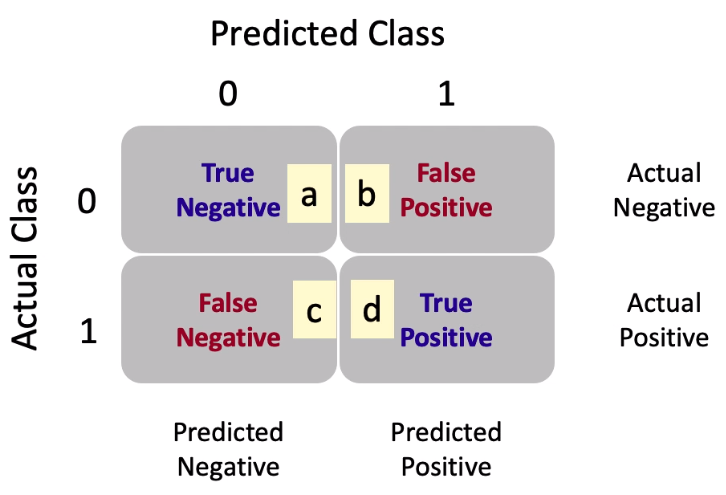
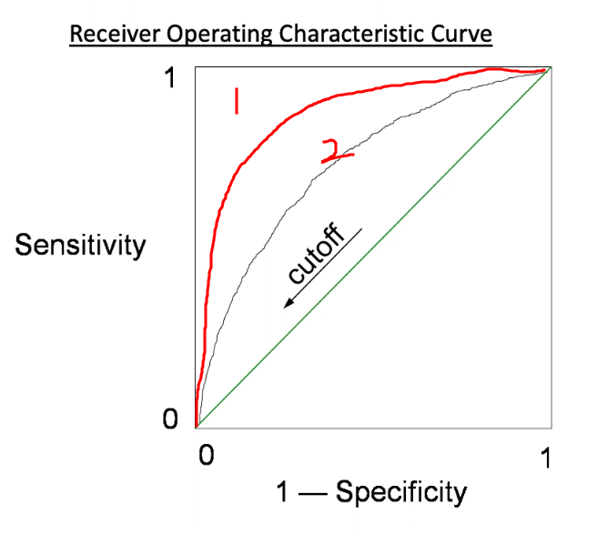

## Entropy

1\. Shannon information

$$
I = -\log_2{p}
$$

* $ p $ is the probability of the event
* Event with smaller probability contains more information.
* Logrithm base is 2 beacause in information technology 1 bit represents "0" or "1".

It can also be regarded as how many bits we need to represent a random variable

$$
\#bits = \log_2{1\over{p}}
$$

For example, when one variable has 8 possibilities. Each of them has a probability of 1/8. Then we need $ \log_2{8} = 3 $ bits to represent the variable.

2\. Shannon entropy

$$
H = - \sum_{i=1}^{n}{p_i\log_{2}{p}_i}
$$

* $ H $ is sum of all possible events
* `H = 1` means completly uncertain about the result. `H = 0` means the result is known.

For example, if we throw a coin, it will have 2 results, both probabilities is 0.5.

$$
H = -0.5 \times \log_2{0.5} - 0.5 \times \log_2{0.5} = 1
$$

The result is totally uncertain.

3\. Information gain

$$
IG(T, a) = H(T) - H(T|a) \\
H (T|a) = -\sum_{x \in {a}, y \in{T}}{p(x, y)\log{p(x, y) \over {p(x)}}}
$$

* $ H(T|a) $ is the [conditional entropy](https://en.wikipedia.org/wiki/Conditional_entropy) of T given the value of attribute a.

## ID3 (Iterative Dichotomiser 3) Algorithm

ID3 is an algorithm invented by Ross Quinlan used to generate a decision tree from a dataset.

It can be used for dataset with categorical features like:

| Day | Outlook | Temperature | Humidity | Wind | Play ball |
| :---: | :---: | :---: | :---: | :---: | :---: |
| D1 | Sunny | Hot | High | Weak | No (-) |
| D2 | Sunny | Hot | High | Strong | No (-) |
| D3 | Overcast | Hot | High | Weak | Yes (+) |
| D4 | Rain | Mild | High | Weak | Yes (+) |
| D5 | Rain | Cool | Normal | Weak | Yes (+) |
| D6 | Rain | Cool | Normal | Strong | No (-) |
| D7 | Overcast | Cool | Normal | Strong | Yes (+) |
| D8 | Sunny | Mild | High | Weak | No (-) |

Pseudocode:

``` shell
ID3 (Examples, Target_Attribute, Attributes)
    Create a root node for the tree
    If all examples are positive, Return the single-node tree Root, with label = +.
    If all examples are negative, Return the single-node tree Root, with label = -.
    If number of predicting attributes is empty, then Return the single node tree Root,
    with label = most common value of the target attribute in the examples.
    Otherwise Begin
        A ← The Attribute that best classifies examples.
        Decision Tree attribute for Root = A.
        For each possible value, vi, of A,
            Add a new tree branch below Root, corresponding to the test A = vi.
            Let Examples(vi) be the subset of examples that have the value vi for A
            If Examples(vi) is empty
                Then below this new branch add a leaf node with label = most common target value in the examples
            Else below this new branch add the subtree ID3 (Examples(vi), Target_Attribute, Attributes – {A})
    End
    Return Root
```

ID3 does not guarantee an optimal solution. It can converge upon local optima. It uses a greedy strategy by selecting the locally best attribute to split the dataset on each iteration.

## C4.5 Algorithm

It can be used for data with continuous features.

Procedure:

1. Sort the data records by the attribute values
2. Calculate the partition point for 2 consecutive records by $ (v_i + v_{i+1})/2 $
3. Partition the records into 2 sets by that partition point
4. Calculate the entropy reduction (information gain) of the resulting partitions
5. If all partition points are calculated, choose the point that yields the highest entropy reduction. Otherwise, ad i by 1 and go back to `step 2`

The whole process is nearly the same as ID3 algorithm, except for continuous feature, we need to calculate the partition point. But in ID3 algorithm, we can directly use the categories to split records.

## k-Nearest Neighbors Algorithm

Distance between instance i and j

$$
d(x^{(i)}, x^{(j)}) = \sqrt{\sum_{r=1}^{n}{(f_r(x^{i})-f_r(x^{(j)}))^2}}
$$

$f_r(x)$ is the feature value of instance $ x $.

To predict a new instance $ x^{(q)} $:

1\. Continues value

$$
\hat{f} \gets \frac{1}{k} \sum_{i=1}^{k}f(x^{(ki)})
$$

2\. Discrete values

$$
\hat{f} \gets \text{argmax}_{v \in V} \sum_{i=1}^{k} I(f(x^{(i)}) == v)
$$

We can also use distance weighted nearest neighbor algorithm:

$$
\hat{f} \gets \frac{\sum_{i=1}^{k}{w_if(x^{(i)})}}{\sum_{i=1}^{k}{w_i}}, \ \text {where} \ w_i = \frac{1}{d(x^{(q)}, x^{(i)})^2}
$$

## Evaluation Classification

1\. Evaluation Metrics



$$
Accuracy = \frac{a+d}{a+b+c+d} \\
Precision = \frac{d}{b+d} \\
Sensitivity = Recall = \frac{d}{c+d} \\
Specificity = \frac{a}{a+b} \\
(False\ Positive\ Rate = 1 - Specificity)
$$

2\. Area Under ROC Curve (AUC)



- Cutoff is the threshold a classification model uses to split between 2 classes.
- As the cutoff decreases, more and more cases are classified as 1; hence, the sensitivity increases and speificity decreases.
- As the ROC curvebows above the diagonal, the predictive power increases. Curve 1 is better than curve 2

## Issues in Decision Tree Learning

1\. Features with many unique values

**Problem:** *Gain* tends to select features with many unique values to clssify instance.

**Solution:** Adjust *Gain* to *GainRatio*

$$
SplitInfomation(S,A) \equiv -\sum_{i=1}^{c}\frac{|S_i|}{|S|}\log_2{\frac{|S_i|}{|S|}} \\
GainRatio(S,A) = \frac{Gain(S,A)}{SplitInfomation(S,A)} 
$$

$ S $ is the set of all records in a prarent node. $ S_i $ is a subset of records that have feature $ A_i $

When should Gain Ratio be used in place of Gain?

- Compute both Gain Ratio and Gain for each feature
- Use Gain Ratio only for features with above-average Gain

2\. Overfitting

Ways to avoid overfitting:

- Stop growing tree when data split is not statistically significant.
- Grow full tree then post-prune.

Selecting best tree:

- Measure performance over taining data
- Measure performance over seperate validation datases
- Add penalty against complexity

3\. Unknown feature values

Strategies to impute missing values of feature A:

- Use most common value of A in all instances having missing value for A
- Within each group of instances having same target value, assign most common value of A to instances
